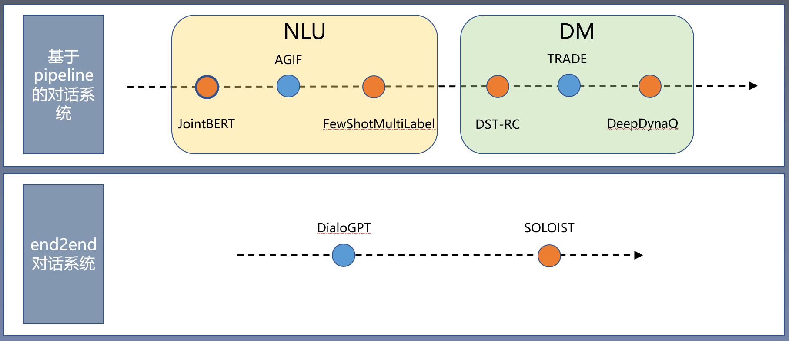

## reading_and_implementing_dialogue_system_papers

本项目围绕任务型对话系统这一话题，对这一子领域的8篇重要论文的代码进行复现和解析。

我们将要复现的八篇论文是

\[JointBERT\] Qian Chen, Zhu Zhuo, Wen Wang. BERT for Joint Intent classification and Slot Filling . 2019

\[AGIF\] Libo Qin, Xiao Xu, Wanxiang Che and Ting Liu. AGIF: An Adaptive Graph-Interactive Framework for Joint Multiple Intent Detection and Slot Filling. EMNLP 2020

\[FewShotMultiLabel
\] Yutai Hou, Yongkui Lai, Yushan Wu, Wanxiang Che, Ting Liu. Few-shot Learning for Multi-label Intent Detection. AAAI 2021

\[DST-RC\] Dialog state tracking: A neural reading comprehension approach

\[TRADE\] Transferable multi-domain state generator for task-oriented dialogue systems. ACL2019

\[DeepDynaQ\] Peng, Baolin and Li, Xiujun and Gao, Jianfeng and Liu, Jingjing and Wong, Kam-Fai and Su, Shang-Yu. Deep Dyna-Q: Integrating Planning for Task-Completion Dialogue Policy Learning. ACL 2018.

\[DialoGPT\] DialoGPT: Large-Scale Generative Pre-training for Conversational Response Generation. ACL2020

\[SOLOIST\] SOLOIST: Building Task Bots at Scale with Transfer Learning and Machine Teaching. TACL

**************************** **Updates** ****************************

<!-- Thanks for your interest in our repo! -->

* 2021/09/14: 上传AGIF文章的代码解析. 

* 2021/09/14: 上传JointBERT文章的代码解析. 

